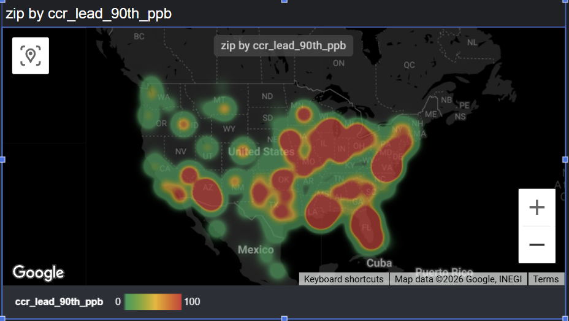
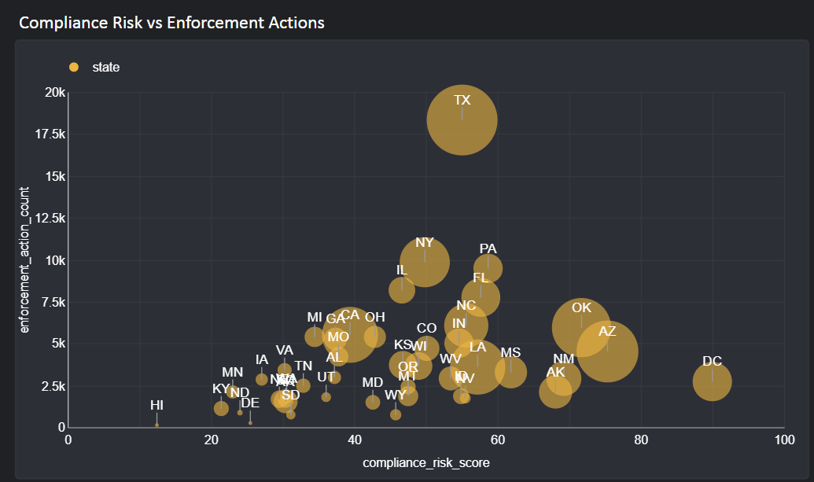
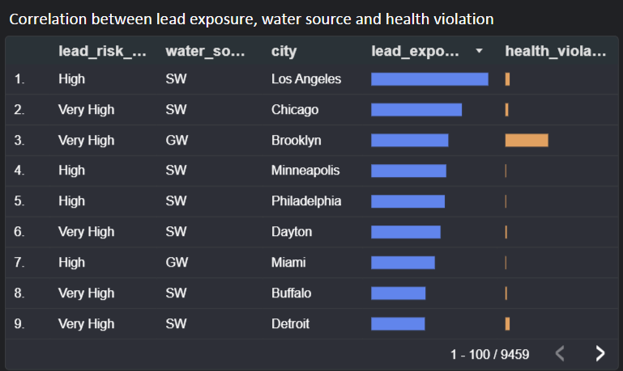
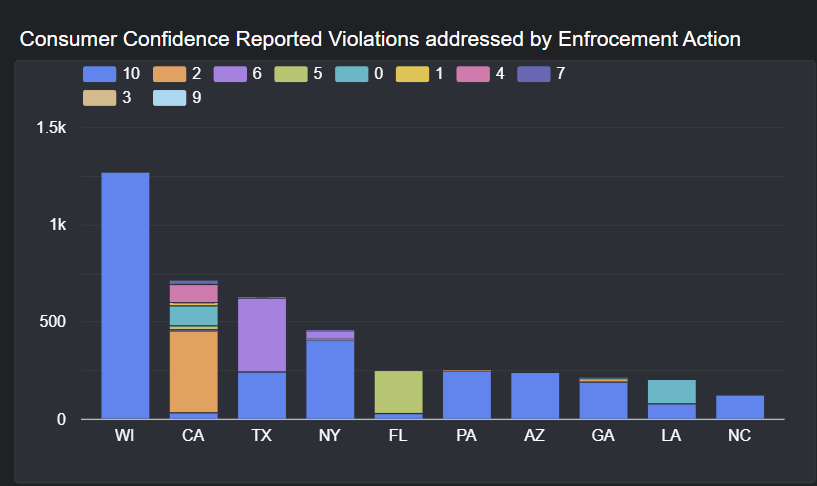

# US Water Quality Data Pipeline

**Data Engineering Zoomcamp — Final Project**

An end-to-end batch data pipeline that ingests, transforms, and visualizes US drinking water quality data across 40,000+ zip codes.

---

## Problem Statement

US drinking water quality varies dramatically by region, but the data is fragmented across EPA violation records, Consumer Confidence Reports (CCR), and infrastructure risk databases. This makes it difficult for residents, journalists, public health researchers, and home buyers to identify which communities face the highest combined risks to their drinking water.

This project builds an end-to-end data pipeline that ingests three daily-updated water quality datasets, consolidates them into a cloud data warehouse, and surfaces insights through an interactive dashboard that answers three key questions:

1. **Which states have the most persistent unresolved violations and elevated lead levels**, and how do CCR-reported lead measurements compare to predicted lead exposure risks?
2. **Which zip codes face the highest compound risks** — combining poor water safety scores, high contaminant counts, and infrastructure/environmental burdens like flood cost and maintenance debt?
3. **How does water quality enforcement vary across states** — and are communities with high compliance risk scores actually the ones receiving enforcement actions?

---

## Dataset

Source: [artakulov/us-water-quality-data](https://github.com/artakulov/us-water-quality-data) (updated daily, CC BY 4.0)

| File | Records | Description |
|---|---|---|
| `zipcheckup-water-quality.csv` | ~42,000 zips | Violations, lead/copper levels, home safety scores |
| `ccr-enriched.csv` | ~10,000 zips | Consumer Confidence Reports parsed from 1,062 water systems |
| `l3-metrics.csv` | ~39,000 zips | Composite risk metrics: lead exposure, compliance, flood, energy burden |

---

## Architecture

```
GitHub CSVs (daily updates)
        │
        ▼
┌─────────────────────┐
│  Prefect Pipeline   │  ← orchestrates 5 tasks per dataset
│  (download → clean  │
│   → parquet → GCS   │
│   → BigQuery)       │
└──────────┬──────────┘
           │
           ▼
┌─────────────────────┐
│  Google Cloud       │
│  Storage (Datalake) │  ← raw/YYYY-MM-DD/*.parquet
└──────────┬──────────┘
           │
           ▼
┌─────────────────────┐
│  BigQuery           │  ← raw_zipcheckup, raw_ccr_enriched, raw_l3_metrics
│  (Data Warehouse)   │     (partitioned + clustered)
└──────────┬──────────┘
           │
           ▼
┌─────────────────────┐
│  dbt                │  ← staging views → mart tables
│  Transformations    │
└──────────┬──────────┘
           │
           ▼
┌─────────────────────┐
│  Looker Studio      │  ← Geo bubble maps, KPI tiles, bar charts
│  Dashboard          │
└─────────────────────┘

GitHub Actions triggers the full pipeline daily at 12:00 PM UTC.
```

---

## Tech Stack

| Layer | Tool |
|---|---|
| **Cloud** | Google Cloud Platform (GCP) |
| **Infrastructure as Code** | Terraform |
| **Workflow Orchestration** | Prefect |
| **Data Lake** | Google Cloud Storage |
| **Data Warehouse** | BigQuery |
| **Transformations** | dbt (dbt-bigquery) |
| **Dashboard** | Looker Studio |
| **Scheduling** | GitHub Actions |

---

## Data Warehouse Optimization

All raw tables in BigQuery are **partitioned** and **clustered** for query performance and cost efficiency:

| Table | Partitioning | Clustering | Reason |
|---|---|---|---|
| `raw_zipcheckup` | `ingestion_date` (DAY) | `state` | Dashboard queries aggregate by state and filter by recent dates |
| `raw_ccr_enriched` | `ingestion_date` (DAY) | `zip` | Joined to other tables on `zip`; clustering speeds up joins |
| `raw_l3_metrics` | `ingestion_date` (DAY) | `zip` | Joined on `zip`; no `state` column available |

**Why partitioning by `ingestion_date`:** The pipeline runs daily and we frequently query the latest snapshot. Partitioning by ingestion date means BigQuery only scans the relevant day, drastically reducing scan costs.

**Why clustering by `state` / `zip`:** All mart-level queries either group by state (state-level rollups) or join across the three raw tables on `zip`. Clustering pre-sorts the data so these operations require less I/O.

---

## dbt Models

```
water_quality_dbt/models/
├── staging/                            ← cleans raw tables (views)
│   ├── stg_zipcheckup.sql
│   ├── stg_ccr_enriched.sql
│   └── stg_l3_metrics.sql
└── marts/                              ← analysis-ready tables
    ├── highest_unresolved_water_violations.sql   ← Question 1
    ├── highest_compound_risk.sql                 ← Question 2
    └── water_quality_enforcement_state.sql       ← Question 3
```

---

## Dashboard

**Live Dashboard:** [Looker Studio Link](https://lookerstudio.google.com/reporting/d1fa37cf-69f6-45ad-aa31-776f149ca8fc)

The dashboard contains multiple tiles, including:
- **Geo Heat Map** — 90th percentile lead level in ppb by Zipcode.This number is calculated from all the lead sample results taken at sites within a water system during a monitoring period. If your water supply’s 90th percentile number is over 12 ppb, your community has a lead Action Level Exceedance
- **Scatter Plot** — Compliance risk vs enforcement actions
- **Pivot Tables** — Correlation between lead exposure, water source and health violation
- **Stacked Bar Chart** - CCR reported violation that addressed by enforcement actions







---

## Reproducibility — How to Run This Project

### Prerequisites

- Google Cloud Platform account with billing enabled
- [Terraform](https://developer.hashicorp.com/terraform/install) installed
- Python 3.11+
- A GCP service account with the following roles:
  - `Storage Admin`
  - `BigQuery Admin`
- Service account JSON key saved to `keys/cred_keys.json`

### Step 1 — Clone the Repository

```bash
git clone https://github.com/Alyshroff0912/Final_Course_Project.git
cd Final_Course_Project
```

### Step 2 — Provision GCP Infrastructure (Terraform)

This creates the GCS bucket and BigQuery dataset.

```bash
terraform init
terraform plan
terraform apply
```

You should see:
- GCS bucket: `final_project_water_quality_raw`
- BigQuery dataset: `final_project_water_quality_dataset`

### Step 3 — Set Up Python Environment

```bash
python -m venv .venv
# Windows
.venv\Scripts\activate
# Mac/Linux
source .venv/bin/activate

pip install -r prefect/requirements.txt
pip install dbt-bigquery
```

### Step 4 — Run the Ingestion Pipeline (Prefect)

This downloads the 3 CSVs from GitHub, cleans them, saves Parquet files to GCS, and loads them into BigQuery.

```bash
python prefect/flows/ingest_water_quality.py
```

Expected output: 3 raw tables in BigQuery (`raw_zipcheckup`, `raw_ccr_enriched`, `raw_l3_metrics`).

### Step 5 — Configure dbt

Create `~/.dbt/profiles.yml`:

```yaml
water_quality_dbt:
  target: dev
  outputs:
    dev:
      type: bigquery
      method: service-account
      project: final-course-project-491204
      dataset: final_project_water_quality_dataset
      location: US
      keyfile: <ABSOLUTE_PATH_TO>/keys/cred_keys.json
      threads: 1
```

### Step 6 — Run dbt Transformations

```bash
cd water_quality_dbt
dbt debug          # verifies BigQuery connection
dbt run            # builds all staging views and mart tables
```

### Step 7 — View the Dashboard

Open the [Looker Studio dashboard](https://lookerstudio.google.com/reporting/d1fa37cf-69f6-45ad-aa31-776f149ca8fc) — it reads directly from the BigQuery mart tables.

---

## Automated Daily Refresh

The full pipeline runs automatically every day at **12:00 PM UTC** via GitHub Actions.

See [`.github/workflows/daily_ingestion.yml`](.github/workflows/daily_ingestion.yml) — it:
1. Authenticates to GCP using a stored service account key
2. Runs the Prefect ingestion pipeline
3. Runs `dbt run` to refresh all mart tables

To enable this on your own fork, add your service account JSON as a GitHub secret named `GCP_CREDENTIALS`.

---

## Project Structure

```
Final_Course_Project/
├── .github/workflows/
│   └── daily_ingestion.yml          ← daily scheduled pipeline
├── keys/
│   └── cred_keys.json               ← GCP service account (gitignored)
├── prefect/
│   ├── flows/
│   │   └── ingest_water_quality.py  ← Prefect ingestion DAG
│   └── requirements.txt
├── water_quality_dbt/
│   ├── dbt_project.yml
│   └── models/
│       ├── staging/
│       └── marts/
├── main.tf                          ← Terraform GCP resources
├── variables.tf                     ← Terraform variables
└── README.md
```

---

## License

Source data licensed under [CC BY 4.0](https://creativecommons.org/licenses/by/4.0/) by [artakulov/us-water-quality-data](https://github.com/artakulov/us-water-quality-data).
